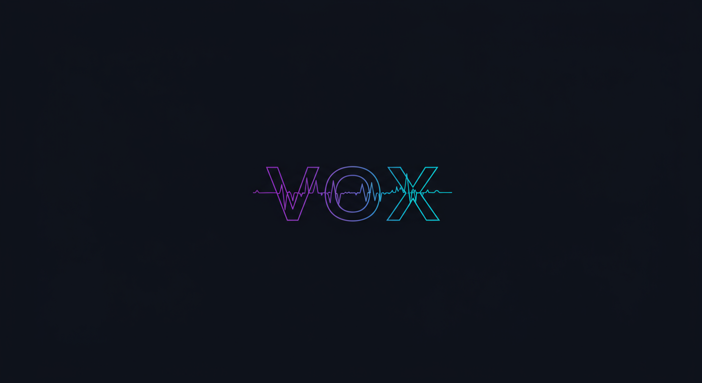

<p align="center">
  
</p>

<h1 align="center">vox</h1>

<p align="center">
  CLI TTS cross-platform avec cinq backends et serveur MCP pour assistants IA.
</p>

<p align="center">
  <a href="README.md">English</a> &bull;
  <a href="README_fr.md">Fran&ccedil;ais</a> &bull;
  <a href="README_zh.md">中文</a> &bull;
  <a href="README_ja.md">日本語</a> &bull;
  <a href="README_ko.md">한국어</a> &bull;
  <a href="README_es.md">Espa&ntilde;ol</a>
</p>

---

## Installation

```bash
# Installation rapide (macOS / Linux / WSL)
curl -fsSL https://raw.githubusercontent.com/rtk-ai/vox/main/install.sh | sh

# Depuis les sources
cargo install --path .

# Avec acceleration GPU
cargo install --path . --features metal  # macOS Apple Silicon
cargo install --path . --features cuda   # Linux NVIDIA
```

## Demarrage rapide

```bash
vox "Bonjour le monde"                  # Parler avec le backend par defaut
vox -b voxtream "Zero-shot TTS."        # VoXtream2 (le plus rapide)
vox -b kokoro -l fr "Bonjour"           # Kokoro avec langue
echo "Texte pipe" | vox                 # Lire depuis stdin
vox setup                               # Configuration interactive (TUI)
```

## Integration IA

Une commande configure **14 outils IA** (Claude Code, Cursor, VS Code, Zed, Codex, Gemini, Amazon Q, etc.) :

```bash
vox init                # Serveur MCP (defaut) — tous les outils
vox init -m cli         # CLAUDE.md + hook Stop
vox init -m all         # Tous les modes
```

## Clonage de voix

```bash
vox clone add patrick --audio ~/voix.wav --text "Transcription"
vox clone record mavoix --duration 10
vox -v patrick "Ceci parle avec votre voix."
```

## Daemon (modeles chauds)

```bash
vox daemon start        # Garde les modeles en memoire
vox daemon status       # Voir les backends charges
vox daemon stop         # Arreter
```

## Conversation vocale (macOS)

```bash
export ANTHROPIC_API_KEY=sk-...
vox chat -l fr          # Discuter avec Claude
vox hear -l fr          # Transcription seule
```

## Documentation

| Document | Description |
|----------|-------------|
| [Architecture](docs/ARCHITECTURE.md) | Architecture technique, backends, schema DB, protocole MCP |
| [Fonctionnalites](docs/FEATURES.md) | Documentation de toutes les commandes |
| [Guide](docs/GUIDE.md) | Installation, demarrage rapide, depannage |

## Licence

[Apache-2.0](LICENSE)
